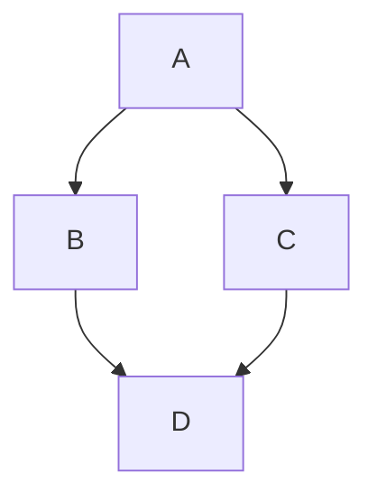
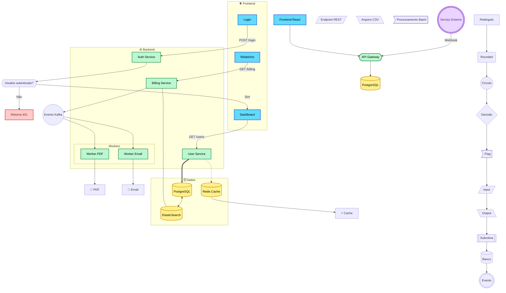

# Comandos de edição

## Introdução

O MDX usa **Markdown** para formatar textos. Isso significa que você pode usar comandos simples para criar títulos, listas, links, códigos e muito mais.

---

## Títulos

Use `#` para criar títulos.

```md
# Título principal (H1)
## Subtítulo (H2)
### Seção (H3)
#### Seção menor (H4)
```

---

## Texto em destaque

### Negrito

```md
**Texto em negrito**
```

Resultado: **Texto em negrito**


### Itálico

```md
*Texto em itálico*
```

Resultado: *Texto em itálico*


### Riscado

```md
~~Texto riscado~~
```

Resultado: ~~Texto riscado~~

---

## Listas

### Lista com marcadores

```md
- Item 1
- Item 2
- Item 3
```


### Lista numerada

```md
1. Primeiro item
2. Segundo item
3. Terceiro item
```


### Lista aninhada

```md
- Item principal
  - Subitem
    - Subsubitem
```

## Citação

```md
> A greater than
```

Resultado:
> Pequeno bloco de comentário

## Quebra de linha

```md
  Uma quebra\
  de linha
```
Resultado:\
Uma quebra\
de linha

## Linha transversal

Tanto "***" quanto "---" produzem o mesmo resultado.

```md
***
---
```

Resultado:
***

---

## Abas

```md
import Tabs from '@theme/Tabs';
import TabItem from '@theme/TabItem';

<Tabs>
  <TabItem value="maçã" label="Maçã" default>
    Isso é uma maçã 🍎
  </TabItem>
  <TabItem value="laranja" label="Laranja">
    Isso é uma laranja 🍊
  </TabItem>
  <TabItem value="banana" label="Banana">
    Isso é uma banana 🍌
  </TabItem>
</Tabs>
```

Resultado:

import Tabs from '@theme/Tabs';
import TabItem from '@theme/TabItem';

<Tabs>
  <TabItem value="maçã" label="maçã" default>
    Isso é uma maçã 🍎
  </TabItem>
  <TabItem value="laranja" label="laranja">
    Isso é uma laranja 🍊
  </TabItem>
  <TabItem value="banana" label="Banana">
    Isso é uma banana 🍌
  </TabItem>
</Tabs>

---

## DropDown

```md
<details>
  <summary>Por que utilizar a base de conhecimento fornecida?</summary>

  Pois ela simplifica e agiliza o atendimento!
</details>
```

Resultado:
<details>
  <summary>Por que utilizar a base de conhecimento fornecida?</summary>

  Pois ela simplifica e agiliza o atendimento!
</details>

---

## Tabelas

```md
| Nome | Idade | Cidade |
|-------|--------|---------|
| Ana   | 28     | Porto Alegre |
| João  | 35     | Garibaldi |
| Maria | 22     | Bento Gonçalves |
```

Resultado:
| Nome | Idade | Cidade |
|-------|--------|---------|
| Ana   | 28     | Porto Alegre |
| João  | 35     | Garibaldi |
| Maria | 22     | Bento Gonçalves |

---

## Grafos

~~~md

~~~

Resultado:


Exemplo avançado com diversas funcionalidades:



## Links

Os links podem ser criados utilizando caminhos absolutos ou relativos.

```md
//Caminho absoluto
[Texto do link](https://google.com)
```
Resultado: [Texto do link](https://google.com)

```md
//Caminho relativo
[Texto do link](./(nome do arquivo .mdx a ser linkado)
```
Resultado: [Texto do link](./create-a-page.mdx)

**Obs:** No resultado do caminho relativo, foi utilizado o caminho do artigo de criação de página.

---

## Imagens

A mesma que os links possuem os caminhos absolutos e relátivos, isso se aplica aos caminhos das imagens.

```md
//Caminho absoluto

```
Resultado: 

```md
//Caminho relativo

```

Resultado: 

:::info[Dica]

Para padronizar e deixar o projeto melhor, é recomendado que quando for adicionar uma imagem, colocar a mesma no seguinte caminho:
https://github.com/datachamp-processamentos-e-servicos/interno/tree/main/static/img. Dentro desta pasta /img, pode-se criar outras pastas
para manter uma organização ainda maior. Para utiliza-las em um artigo, utilizar o caminho relativo desta página.

:::

---

## Caixas de Destaque

São usadas para destacar informações importantes dentro da documentação.

Eles ajudam a chamar atenção para dicas, avisos e mensagens críticas.


### Tip (Dica)

```md
:::tip[(Titulo da caixa)]
Use isso para destacar informações úteis ou boas práticas.
:::
```

Resultado:
:::tip[(Titulo da caixa)]
Use isso para destacar informações úteis ou boas práticas.
:::

### Info (Informação)

```md
:::info[(Titulo da caixa)]
Este bloco é usado para informações gerais e contextuais.
:::
```


Resultado:
:::info[(Titulo da caixa)]
Este bloco é usado para informações gerais e contextuais.
:::


### Warning (Aviso)

```md
:::warning[(Titulo da caixa)]
Use este bloco para alertar sobre possíveis problemas ou cuidados.
:::
```

Resultado:
:::warning[(Titulo da caixa)]
Use este bloco para alertar sobre possíveis problemas ou cuidados.
:::


### Danger (Perigo)

```md
:::danger[(Titulo da caixa)]
Este bloco indica ações perigosas ou irreversíveis.
:::
```

Resultado:
:::danger[(Titulo da caixa)]
Este bloco indica ações perigosas ou irreversíveis.
:::


---

## Inserindo vídeos do YouTube

É possível adicionar vídeos do YouTube diretamente na documentação usando um componente pronto do Docusaurus.


### Como importar

Primeiro, importe o componente:

```mdx
import Youtube from '@site/src/components/Youtube';
```


### Como usar

Depois, basta usar o componente informando o ID do vídeo:

```mdx
<Youtube id="NBOYISh5jC4" />
```

### O que é o ID do vídeo?

O ID é a parte final da URL do YouTube.

Exemplo:

```txt
https://www.youtube.com/watch?v=NBOYISh5jC4
```

O ID é:

```txt
NBOYISh5jC4
```


### Resultado

O vídeo será exibido diretamente dentro da página da documentação.

---

## MDX e Componentes React

O [MDX](https://mdxjs.com/) permite tornar sua documentação mais **interativa** e possibilita o uso de qualquer **componente React dentro do Markdown**.

```jsx
export const Highlight = ({children, color}) => (
  <span
    style={{
      backgroundColor: color,
      borderRadius: '20px',
      color: '#fff',
      padding: '10px',
      cursor: 'pointer',
    }}
    onClick={() => {
      alert(`You clicked the color ${color} with label ${children}`)
    }}>
    {children}
  </span>
);

Este é o <Highlight color="#25c2a0">Docusaurus green</Highlight> !

Este é o <Highlight color="#1877F2">Facebook blue</Highlight> !
```

export const Highlight = ({children, color}) => (
  <span
    style={{
      backgroundColor: color,
      borderRadius: '20px',
      color: '#fff',
      padding: '10px',
      cursor: 'pointer',
    }}
    onClick={() => {
      alert(`You clicked the color ${color} with label ${children}`);
    }}>
    {children}
  </span>
);

Este é o <Highlight color="#25c2a0">Docusaurus green</Highlight> !

Este é o <Highlight color="#1877F2">Facebook blue</Highlight> !
